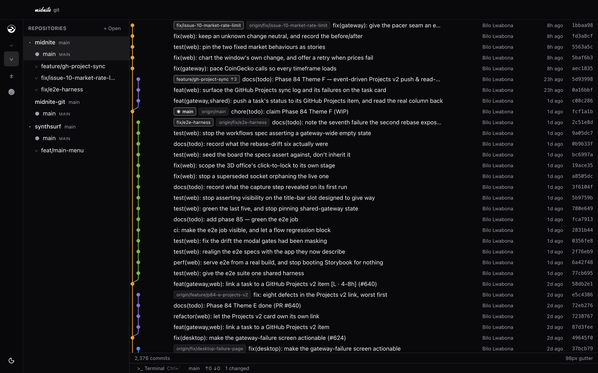
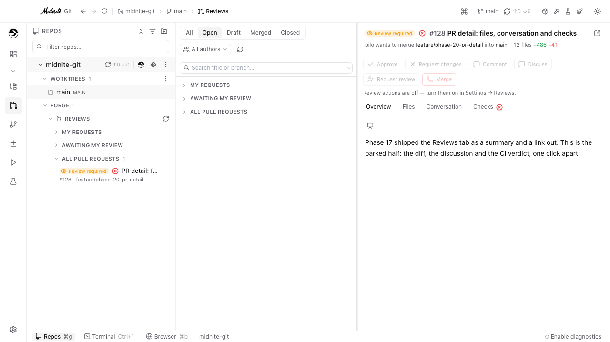
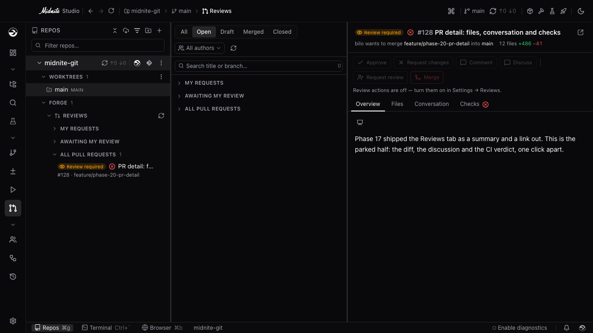
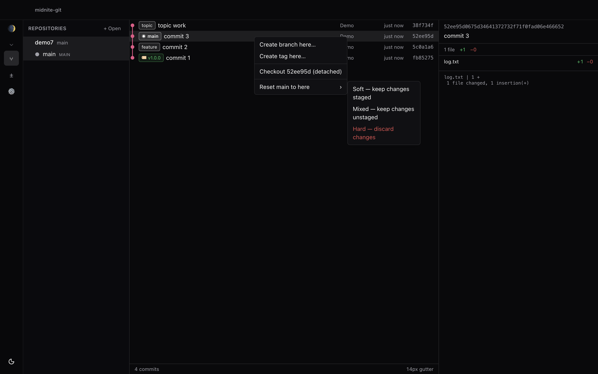
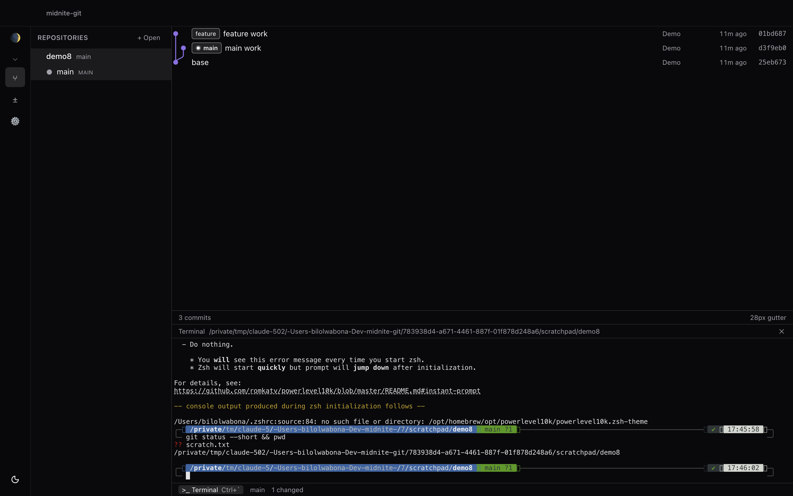
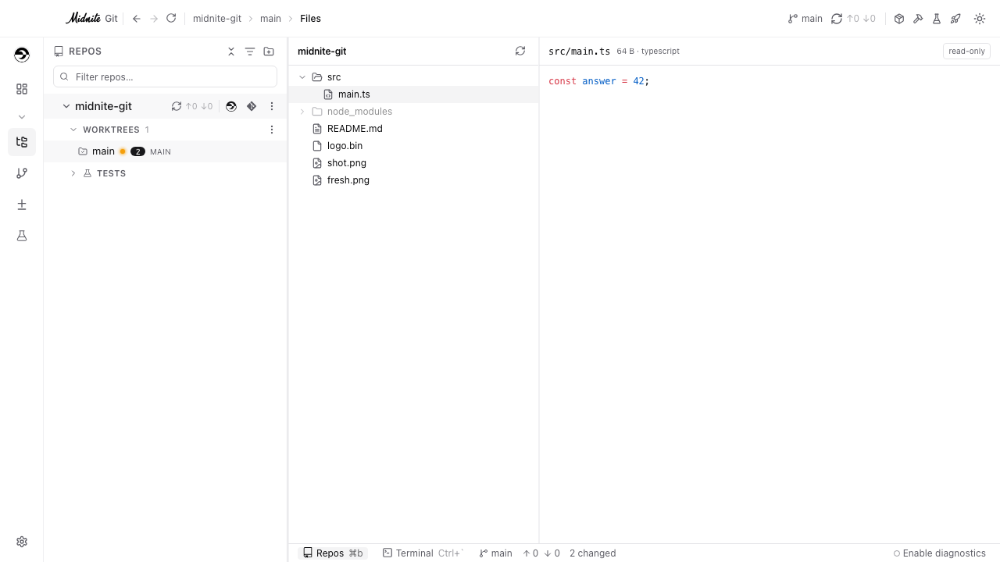
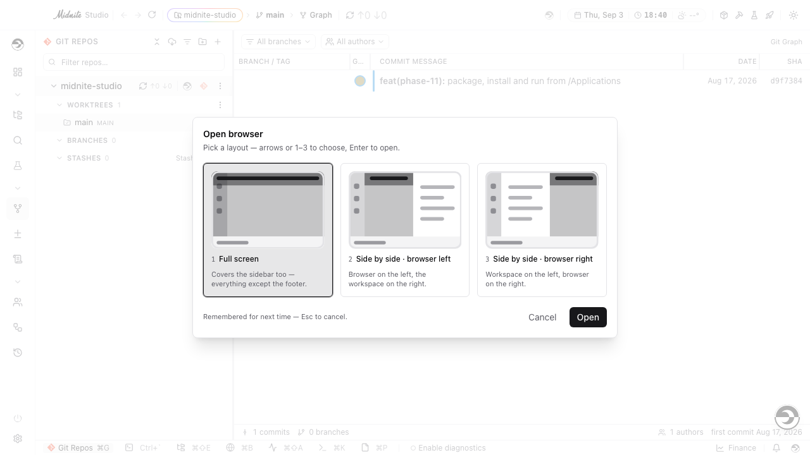
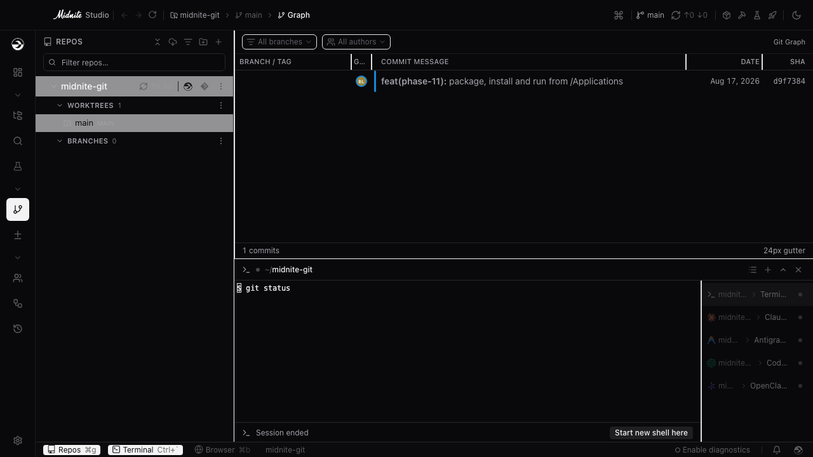
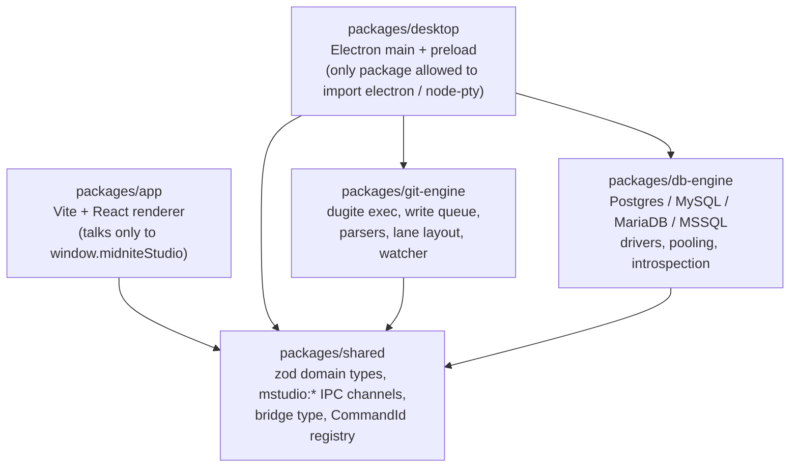
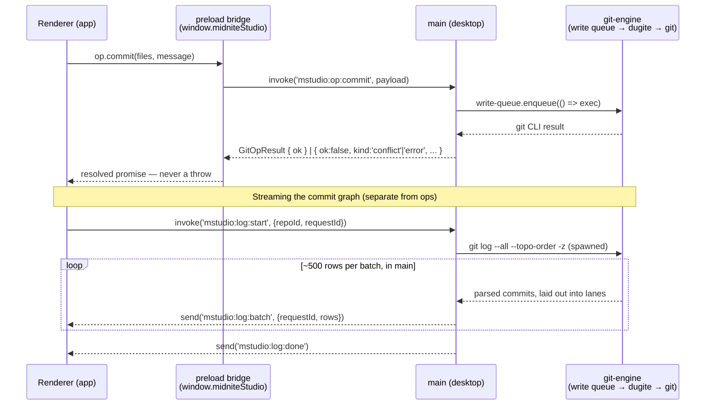

# Midnite Studio

A desktop workspace for the whole loop around a repository: a GitKraken-inspired git client at
its centre, with an integrated terminal running a roster of CLI coding agents, a full file
explorer, an embedded browser, multiple detachable windows, and the forge (PRs, checks, reviews,
issues) — all in the same app. Plain Electron + typed IPC, a Vite + React renderer, and the
published [`@bilo-io/ui`](https://github.com/bilo-io/midnite-ui) design system.



<sub>Running `~/Dev/midnite` — linked worktrees nested under their repository, 2,376 commits,
live branch and sync state in the footer. The crescent and the wordmark face are the midnite
app's own.</sub>

**Design source of truth:** [`docs/INITIAL_PLAN.md`](docs/INITIAL_PLAN.md).
**Progress tracker:** [`.midnite/tasks/`](.midnite/tasks/) (see the [index](.midnite/tasks/_INDEX.md)) — one checklist per phase, an append-only
[`done.md`](.midnite/tasks/done.md), and deliberately-deferred scope in
[`outstanding.md`](.midnite/tasks/outstanding.md).

## Light & dark

Every surface — including forge views like the PR detail below — follows the app's theme, not
just the chrome around it.

<table>
<tr>
<td width="50%"></td>
<td width="50%"></td>
</tr>
</table>

## What it does

1. **An interactive commit graph** — coloured branch lanes laid out in the main process and drawn
   as one SVG per virtualized row. Right-click a commit to branch, tag, check out detached or
   reset; right-click a badge to check out, rename or delete; double-click a badge to check it
   out; drag a branch onto another to merge or rebase, or a commit onto a branch to cherry-pick.
   Anything that can orphan commits asks first, and shows how many.

   

2. **A worktree-aware sidebar** — repositories with their linked worktrees nested underneath,
   per-worktree status, staging, committing, and fetch/pull/push with ahead-behind counts.

3. **The forge, in the same window** — pull requests, reviews, checks and issues read straight
   from GitHub: open/draft/merged/closed filters, "my requests" / "awaiting my review" queues, and
   a PR detail pane with Overview / Files / Conversation / Checks tabs and an Approve / Request
   changes / Merge bar.

   

4. **An integrated terminal** — the user's real login shell, in the selected worktree, toggled
   with `` Ctrl+` `` on every platform.

   

5. **A file explorer with a preview pane** — a read-only tree with git-status glyphs, and a
   preview that renders code (shiki syntax highlighting), markdown, images, PDFs and media.

   

6. **An embedded browser** — a real `WebContentsView`-backed browser pane, opened full-screen or
   side-by-side with the rest of the app, with its own tabs and a partitioned session per tab.

   

7. **Multi-agent CLI support** — the terminal's agent roster isn't one agent, it's twelve:
   Claude Code, Antigravity, Codex, Cursor, Copilot, OpenClaude, opencode, Kilo, Aider, Cline,
   Grok and Goose, each with its own icon, identity and its own settings page for
   install/version-detection/update/API keys — installing one is adding a row to a table, not
   shipping a release.

   

8. **Multi-window & detachable panels** — the graph, terminal, browser, repos sidebar and the
   quick-access console can each pop out into their own OS window (more than one at a time),
   independently sized and positioned, and re-dock back into the main window.

The UI follows the repository live: a commit made in the terminal (or anywhere else) appears in
the graph without a refresh.

### …and more

The app has grown well past its original three pillars. Also built in: a **dashboard** (repo
health, activity, recent CI); **GitHub Projects boards**, including an **agentic Kanban** where a
card carries its own running agent; a **workflow builder**; a **Postman-compatible API client**
with a **database explorer** (Postgres/MySQL/MariaDB/MSSQL) alongside it; a **Conflict Resolution
Studio** for 3-way merge conflicts; a **Video Studio**; a **Markdown slide deck viewer**, wherever
markdown already renders; a voice-capable **AI companion**; and a rail of embedded third-party
apps (Spotify, Google Calendar, YouTube), each independently detachable. See
[`.midnite/tasks/_INDEX.md`](.midnite/tasks/_INDEX.md) for the full, current list.

## Prerequisites

- [proto](https://moonrepo.dev/proto) — `proto use` installs the pinned node 22.12.0 /
  pnpm 9.15.0 / moon 2.3.4 from [`.prototools`](.prototools).
- A GitHub token with **`read:packages`**, exported as `GITHUB_PACKAGES_TOKEN`. GitHub Packages
  requires an `Authorization` header even for public packages, so `pnpm install` fails without it:

  ```sh
  gh auth refresh -s read:packages
  export GITHUB_PACKAGES_TOKEN=$(gh auth token)
  ```

  (A classic PAT with `read:packages` works too. Never commit one — [`.npmrc`](.npmrc) reads it
  from the environment.)

## Getting started

```sh
proto use
export GITHUB_PACKAGES_TOKEN=$(gh auth token)
pnpm install

moon run desktop:start              # Vite dev server + Electron
moon run :typecheck :lint :test     # the gate every change must leave green
```

Useful extras:

```sh
moon run desktop:start-built        # Electron against the built renderer (file://)
moon run desktop:rebuild-native     # node-pty for Electron's ABI, after an Electron bump
moon run desktop:dist               # macOS arm64 dmg + zip → packages/desktop/release
moon run desktop:install-local      # ditto the .app into /Applications
pnpm --filter @midnite/studio-git-engine smoke ~/some/repo   # parse a real repo, print the lanes
```

Prebuilt installers, release notes and the issue tracker live in the public
[`bilo-io/midnite-apps`](https://github.com/bilo-io/midnite-apps) repo, not here — see
**Packaging** below.

## Architecture

```
shared ◀ git-engine ◀ desktop
shared ◀ db-engine ◀ desktop
shared ◀ app
shared ◀ desktop
```

| Package | Role |
|---|---|
| [`packages/shared`](packages/shared) | The wire contract: domain zod schemas, `mstudio:*` channel constants, per-channel payload schemas, the preload bridge type, the CommandId registry. zod only — no other workspace package, never `electron`. |
| [`packages/git-engine`](packages/git-engine) | Everything that touches git, as plain Node/TS: dugite exec, the per-repo write queue, NUL-delimited parsers, commands, the lane layout, the watcher. Never imports `electron`, so it stays testable under bare vitest. |
| [`packages/db-engine`](packages/db-engine) | The same shape as `git-engine`, one level over: Postgres/MySQL/MariaDB/MSSQL drivers behind one interface, connection pooling, schema introspection — backs the API client's Database tab. Plain Node/TS, never `electron`. |
| [`packages/app`](packages/app) | The renderer. Reaches the main process only through `window.midniteStudio`. |
| [`packages/desktop`](packages/desktop) | Electron main + preload. The only package allowed to import `electron` and `node-pty`. |

(`packages/website` — the public marketing site — is deliberately off this graph entirely; see
[`docs/WEBSITE.md`](docs/WEBSITE.md).)

Those arrows are enforced by [`eslint.config.mjs`](eslint.config.mjs), not by convention: each
package has `no-restricted-imports` groups whose messages name the correct alternative. If a
boundary rule fires, the fix is an IPC channel.



Every op crosses the process boundary through a typed IPC contract, never a thrown exception:



A few decisions worth knowing before changing things:

- **Git is the real CLI**, via [dugite](https://github.com/desktop/dugite). That is what makes the
  user's credential helpers, SSH agent, commit signing and `~/.gitconfig` work with no code on our
  side. Reads run with `LC_ALL=C`, `GIT_OPTIONAL_LOCKS=0` and `GIT_TERMINAL_PROMPT=0`; `HOME` is
  never overridden.
- **All parsing is NUL-delimited.** Branch names and commit subjects contain spaces and newlines.
- **All writes go through the per-repo write queue** — concurrent writers race on `index.lock`.
- **Ops never throw across IPC.** They return a `GitOpResult` envelope, so a conflict is a state
  the UI renders rather than an exception it catches.
- **Lane layout runs in main**, so the renderer receives finished `GraphRow`s and only draws.
- **Force-push is `--force-with-lease` only**, through its own gated, default-off entry point
  behind the per-ref badge menu — never a bare `--force`, and never from the title bar.

## Performance

Perf claims come with a number, or they don't ship. Every measurement launches a
**packaged-equivalent** build (`moon run app:build desktop:bundle` first — dev-mode numbers are
noise), takes a median of 5 runs where timing can flake, and the instrumentation itself
(`MSTUDIO_PERF=1`) is a no-op in a normal build — nothing perf-shaped ships in the product.

```sh
moon run app:build desktop:bundle                       # packaged-equivalent, required first
node scripts/perf/startup-report.mjs --runs=5 --rss      # cold-start marks
node scripts/perf/bundle-report.mjs [--assert]           # entry chunk / total JS vs. budget
node scripts/perf/idle-cpu.mjs --seconds=300 [--blurred] # % of one core, focused or backgrounded
node scripts/perf/memory-report.mjs --action=terminal    # bytes retained per cycle (leak check)
moon run app:perf                                        # the whole budget suite (Playwright)
```

Real numbers, measured this way (Darwin arm64; see
[`scripts/perf/README.md`](scripts/perf/README.md) and
[`scripts/perf/budgets.json`](scripts/perf/budgets.json) for the full methodology and history):

| Metric | Measured | CI budget |
|---|---|---|
| Cold start → ready-to-show | 570 ms | ≤ 1,425 ms |
| Renderer interactive | 179 ms | ≤ 450 ms |
| Diff-scroll frame gap (4,000-line diff) | 8.5 ms | ≤ 22 ms |
| Entry chunk | 1,434.7 KB | ≤ 1,520 KB |
| Idle CPU, window blurred | ~0.1–0.4% of one core | 0 stray git/gh subprocess spawns |
| Hidden terminal session (no mounted xterm) | ~8.9 MB/session | — |
| Hidden browser tab, backgrounded | ~79.6–79.8 MB/tab | — |
| Detached "Graph" popout window | ~291–398 MB extra RSS | ≤ 457.5 MB |

Budgets are ceilings under a *known* state, re-baselined only with the run that justifies the
change (2.5× headroom on timings for flakiness, ~1.15× on byte counts, which don't flake). The
budget suite runs deliberately **outside** `moon run :test`'s gate — a timing assertion that
blocks a green build on a busy laptop gets disabled rather than read, not fixed. One number is
currently over its own budget and says so in the file: total JS sits at 35,405.7 KB against a
15,950 KB budget, attributed to accumulated Monaco worker chunks rather than any single change,
and tracked for a rebaselining pass rather than silently raised.

## Packaging

`moon run desktop:dist` produces a macOS arm64 dmg and zip in `packages/desktop/release`.

Main and preload are bundled by esbuild into two files, inlining the workspace packages. That is
not an optimisation: electron-builder follows pnpm's workspace symlinks into sibling directories
and fails, so the packaged app's only runtime dependencies are `dugite` and `node-pty`. Both need
to be outside the asar — dugite ships a 42MB git tree it resolves relative to its own `__dirname`,
and native modules cannot load from an archive.

Builds are unsigned by default and ad-hoc signed by
[`scripts/afterpack.cjs`](packages/desktop/scripts/afterpack.cjs) so they still launch. With a
Developer ID certificate in `CSC_LINK` + `CSC_KEY_PASSWORD`, electron-builder signs properly.

This repo is private; installers, release notes and the public bug tracker are mirrored to
[`bilo-io/midnite-apps`](https://github.com/bilo-io/midnite-apps) on release, which serves
every midnite app the same way (namespaced release tags, a `generic` updater feed rather than
GitHub's — see [`docs/RELEASING.md`](docs/RELEASING.md)).

## Contributing

Work phase by phase from [`.midnite/tasks/`](.midnite/tasks/). Every change leaves
`moon run :typecheck :lint :test` green; visual changes get a screenshot in
[`docs/screenshots/`](docs/screenshots).

## Onboarding another repo

[`templates/midnite/`](templates/midnite/) is a checked-in, repo-agnostic skeleton of this same
workflow — the `.midnite/tasks/` tracker, the nine core skills mirrored into `.claude/`, `.agents/`
and `.codex/`, and `CLAUDE.md`/`AGENTS.md`/`GEMINI.md` stubs — for onboarding a *different* repo
onto it, not this one. The midnite menu's Setup leaf is what will copy it in and track a hash
manifest so a re-run is an upgrade rather than a guess (Phase 49); until then,
[`midnite-setup`](.claude/skills/midnite-setup/SKILL.md) is the interactive path — it emits this
same tree. See the template's own [README](templates/midnite/README.md) for what ships and why
three of this repo's twelve skills are deliberately left out.
