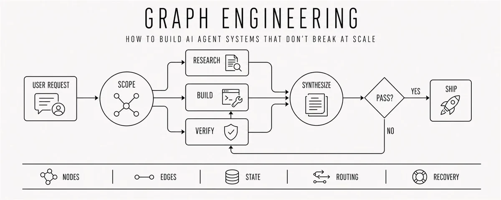

# AGENTIC SOFTWARE ENGINEERING


## Graph Engineering: How to Build AI Agent Systems That Don't Break at Scale


[rari@0xwhrrari]()
[x.com - 10 Aug 2026](https://x.com/0xwhrrari/status/2086784668003598356)

Most builders still design AI agents as a straight line.

Research first.

Write second.

Review third.

Ship last.

Each step waits for the one before it, even when half of them never needed the previous result.

The system does not branch.

It does not parallelize.

It does not know how to recover.

It just keeps feeding one context window until the agent gets slow, confused, or expensive.

The problem is no longer the prompt.

The problem is the shape of the work.

That is what graph engineering fixes.

---

### What Graph Engineering Actually Means

Graph engineering is the practice of turning an agentic workflow into an explicit execution map.

Instead of hiding every decision inside one model loop, you define the system as nodes and edges:

```plaintext
NODE   = one bounded unit of work
EDGE   = a real dependency between two nodes
STATE  = the data that survives between nodes
ROUTER = the rule that selects the next edge
GATE   = the check that decides whether work can continue
```

A node can be an agent, a tool call, a deterministic function, a verifier, or a human approval step.

An edge says what is allowed to run next and what data crosses the boundary.

The graph decides which loops run, in what order, with which branches, joins, and recovery paths.

> A loop helps one agent improve its work. A graph coordinates many loops into one system.

---

### 1. Stop Treating Every "And Then" As A Dependency

Most agent workflows are linear because that is how people write instructions.

Do A, then B, then C.

But sequence is not the same as dependency.

If B does not consume A's output, there is no reason for B to wait.

```plaintext
BAD

collect market data -> inspect repository -> check competitor pricing

BETTER

                 -> collect market data ---------
USER REQUEST     -> inspect repository ----------> SYNTHESIZE
                 -> check competitor pricing ----
```

The first question in graph engineering is simple:

> Does the next step actually read the previous step's output?

If the answer is no, cut the edge.

That single change usually turns a slow chain into a fast parallel graph.

---

### 2. Give Every Node A Contract

A node you cannot describe precisely is a node you cannot route, test, or replace.

Every useful node needs four things:

- One job
- Explicit input
- Structured output
- A clear failure state

```json
{
  "node": "source_researcher",
  "input": {
    "topic": "string",
    "source_type": "primary"
  },
  "output": {
    "claim": "string",
    "source_url": "string",
    "confidence": "high | medium | low"
  },
  "failure": "no_primary_source_found"
}
```

Free text forces the next node to guess what happened.

Structured output turns a model response into something the graph can trust.

This also makes nodes replaceable.

You can swap the model, prompt, or tool without rebuilding the entire system, as long as the contract stays the same.

---

### 3. Treat Edges As Data Contracts, Not Arrows

An edge should not mean "B comes after A".

It should mean "A produced data that B is allowed to consume".

That distinction matters because most workflow plumbing does not need another model call.

Flattening arrays, removing duplicates, filtering nulls, checking a status, and joining records are deterministic operations.

```js
const usable = results
  .filter(Boolean)
  .flatMap(result => result.items)

const unique = [...new Map(
  usable.map(item => [item.source_url, item])
).values()]
```

No agent is needed here.

Save model calls for judgment.

Use code for plumbing.

> A graph where every edge is another agent is paying tokens for its own wiring.

---

### 4. Learn The Four Shapes Behind Almost Every Agent Graph

You do not need fifty patterns.

Most production graphs are combinations of four shapes.

#### The Chain

```plaintext
A -> B -> C
```

Use it when every step genuinely requires the previous output.

It is simple, predictable, and often slower than necessary.

#### The Diamond

```plaintext
        -> B1 -
A ->    -> B2 --> C
        -> B3 -
```

Split one job into independent branches, run them together, then merge the results.

This is the workhorse for research, code review, due diligence, and market scans.

#### The Router

```plaintext
             -> QUICK PATH
CLASSIFY  ---
             -> FULL AUDIT
```

Inspect state and choose only the path the task needs.

Small work stays cheap.

Risky work gets a deeper graph.

#### The Controlled Cycle

```plaintext
WORK -> VERIFY -> PASS -> EXIT
          |
          -> FAIL -> FEEDBACK -> WORK
```

Repeat only when evidence says the result is incomplete.

Every cycle needs a hard stop, a budget, and a convergence rule.

---

### 5. Fan Out Independent Work, Then Join It Deliberately

Parallelism is the easiest graph advantage to understand and the easiest one to abuse.

If five nodes are independent, run them together.

```js
const settled = await Promise.allSettled(
  sources.map(source => researchNode(source))
)

const findings = settled
  .filter(result => result.status === "fulfilled")
  .map(result => result.value)
```

One failed branch should not destroy the other four.

But do not place a barrier after every stage.

A join is worth the wait only when the next node needs the complete set.

Examples include:

- Cross-source deduplication
- Ranking all candidates
- Comparing alternatives
- Deciding whether coverage is complete

If each item can continue independently, keep the graph streaming.

> Parallel is not automatically fast. Your topology decides where the system waits.

---

### 6. Make Routing Inspectable

The model can make a judgment.

The graph should enforce what that judgment is allowed to trigger.

```js
const decision = await classifyRisk(change)

switch (decision.severity) {
  case "low":
    return quickReview(change)

  case "high":
    return fullParallelAudit(change)

  default:
    return humanReview(change)
}
```

The classifier is probabilistic.

The allowed routes are deterministic.

This gives you the model's flexibility without giving it unlimited control over the system.

OpenAI's visual Agent Builder makes this shift obvious: agent behavior is increasingly designed as an inspectable workflow instead of a hidden chain of prompts.

> **OpenAI Developers** ([@OpenAIDevs](https://x.com/OpenAIDevs)) · 6 Oct 2025
>
> Introducing AgentKit — build, deploy, and optimize agentic workflows.
>
> - 💬 ChatKit: Embeddable, customizable chat UI
> - 👷 Agent Builder: WYSIWYG workflow creator
> - 🛤️ Guardrails: Safety screening for inputs/outputs
> - ⚖️ Evals: Datasets, trace grading, auto-prompt optimization

---

### 7. Put Verification On The Edge

The highest-leverage node in a graph is often the one that produces nothing new.

Its job is to stop weak work from moving downstream.

A verifier can check:

- Whether every claim has a source
- Whether the cited source supports the claim
- Whether code passes tests
- Whether the result matches the requested schema
- Whether another independent path reaches the same conclusion

```plaintext
GENERATOR -> VERIFIER -> PASS -> SYNTHESIZER
                 |
                 -> FAIL -> REPAIR
```

Do not ask the same agent to generate, approve, and publish its own work in one context.

Separate the roles.

Separate the prompts.

Separate the failure boundaries.

Anthropic's production research system follows this logic at a larger scale: a lead agent coordinates parallel subagents, findings are synthesized, and a dedicated citation stage attaches evidence before the result reaches the user.

> **Claude** ([@claudeai](https://x.com/claudeai)) · 8 Apr
>
> Introducing Claude Managed Agents: everything you need to build and deploy agents at scale.
>
> It pairs an agent harness tuned for performance with production infrastructure, so you can go from prototype to launch in days.
>
> Now in public beta on the Claude Platform.

---

### 8. State Is The Part Most Diagrams Hide

Boxes and arrows look clean until the system has to resume after a crash.

A production graph needs durable state:

```plaintext
task_id
current_node
completed_nodes
artifacts
decisions
evidence
budgets
retry_counts
human_approvals
```

Do not move giant transcripts between nodes.

Move references to artifacts.

A research node should store its report and return a path, ID, or structured summary.

A reviewer should read the artifact directly instead of receiving a compressed retelling through three agents.

This reduces context loss and makes every transition auditable.

The graph should be able to answer three questions at any moment:

```plaintext
What has already happened
Why did the system choose this route
Where can execution safely resume
```

If it cannot answer them, the graph is still a demo.

---

### 9. Add Cycles Only When They Converge

A cycle is useful when the amount of work is unknown in advance.

Bug discovery, deep research, and iterative repair are good examples.

But "repeat until good" is not a stop condition.

Use measurable convergence:

```js
let dryRounds = 0
let iteration = 0
const seen = new Set()

while (dryRounds < 2 && iteration < 6) {
  const findings = await discover()
  const fresh = findings.filter(item => !seen.has(item.key))

  fresh.forEach(item => seen.add(item.key))
  dryRounds = fresh.length === 0 ? dryRounds + 1 : 0
  iteration += 1
}
```

Notice what the system remembers.

It deduplicates against everything already seen, not only the findings that passed verification.

Otherwise rejected ideas keep returning and the graph pays to rediscover the same dead ends forever.

Every controlled cycle needs:

- A completion test
- A maximum number of rounds
- A token or cost budget
- A record of previous attempts
- An escalation path when convergence fails

---

### 10. Design Failure As A Local Event

In a chain, one broken step can freeze the whole workflow.

In a graph, failure should stay inside the smallest possible boundary.

Each node needs a policy:

```plaintext
RETRY      transient tool or network failure
FALLBACK   preferred model or source unavailable
SKIP       optional branch failed
REPAIR     output failed validation
ESCALATE   risk or uncertainty crossed a threshold
STOP       budget, safety, or permission boundary reached
```

Checkpoint after expensive nodes.

Make writes idempotent so a retry does not duplicate side effects.

Give parallel workers isolated workspaces when they modify files.

Record every routing decision with the state that produced it.

Reliability does not come from hoping every node succeeds.

It comes from deciding what the graph does when one does not.

---

### 11. Topology Is Your Cost Model

A graph is not automatically cheaper than one agent.

It can burn far more tokens if every task spawns a fleet.

The shape controls both latency and cost.

Use cheaper models for bounded extraction, classification, and formatting.

Use stronger models for decomposition, synthesis, and difficult verification.

Route simple tasks through a short path.

Reserve the full graph for work that earns it.

```plaintext
SIMPLE REQUEST -> SMALL MODEL -> QUICK CHECK -> DONE

COMPLEX REQUEST -> PLANNER -> PARALLEL SPECIALISTS
                              -> VERIFIERS
                              -> STRONG SYNTHESIZER
                              -> HUMAN GATE
```

Anthropic reports that multi-agent research can materially outperform a single agent on breadth-first work, but it also uses far more tokens.

That is the tradeoff.

Graph engineering is not about maximizing the number of agents.

It is about spending coordination only where parallelism, specialization, or independent verification creates enough value.

---

### 12. A Production Graph For Research And Publishing

Here is a practical graph for turning one idea into a cited article:

```plaintext
                                  -> COMPANY SOURCES -----
TOPIC -> SCOPE -> DECOMPOSE       -> PAPERS --------------> DEDUPE
                                  -> EXPERT POSTS ---------
                                                             |
                                                             v
                PUBLISH <- HUMAN GATE <- FINAL CHECK <- DRAFT
                                                |          ^
                                                -> FAIL -> REPAIR
```

The system works like this:

1. The scope node defines the question, audience, and completion criteria
2. The decomposition node creates independent research lanes
3. Research nodes run in parallel with separate contexts
4. Deterministic code removes duplicates and normalizes sources
5. The draft node writes from structured evidence
6. The checker validates claims, citations, style, and missing sections
7. Failed checks route only the relevant section back to repair
8. A human approves the final artifact before publishing

This is not one giant agent pretending to be a team.

It is a system with explicit ownership, state, and authority.

---

### When A Graph Is The Wrong Answer

Do not turn every prompt into an architecture diagram.

Keep one agent in one loop when:

- The task is short
- One context can hold all relevant information
- There are no independent branches
- Failure is cheap
- A human can review the final result quickly

Move to a graph when:

- Work can run in parallel
- Different nodes need different tools or permissions
- Outputs require independent verification
- The task must resume after interruption
- Several loops need shared state
- Cost and authority must be controlled by route

Start with one loop.

Draw a graph only when the dependencies force you to.

---

### The Graph Engineering Checklist

Before you ship, ask:

- [ ] Does every edge carry real data or authority?
- [ ] Does every node have one bounded job?
- [ ] Are inputs and outputs structured?
- [ ] Can independent nodes run in parallel?
- [ ] Are joins placed only where the full set is required?
- [ ] Are important results verified before moving downstream?
- [ ] Can failures be retried without duplicating side effects?
- [ ] Can the graph resume from a checkpoint?
- [ ] Does every cycle have a hard stop and budget?
- [ ] Can a human interrupt high-risk paths?
- [ ] Can you explain why every route was selected?
- [ ] Is the graph simpler than the problem it solves?

If the answer to the last question is no, delete nodes.

---

### The Real Shift

Prompt engineering improves the instruction.

Context engineering controls what the model sees.

Harness engineering builds the environment around the model.

Loop engineering makes one unit of work improve through feedback.

Graph engineering coordinates the entire job.

```plaintext
PROMPT  -> CONTEXT -> HARNESS -> LOOP -> GRAPH
message    memory     machine    run     coordination
```

The model is only one node.

The product is the system around it.

> A prompter asks the agent to do more. An architect redesigns the graph so the system can do more safely.

---

If you read this far:

- BOOKMARK THIS.
- Follow @0xwhrrari
- Follow my Private Telegram Channel
- Subscribe to my Substack

---

Also you can read other articles:

- The Three Layers Behind Reliable AI Agents: Harness vs Loop vs Graph Engineering
- [How I set up Obsidian + Claude as my second brain](https://x.com/0xwhrrari/status/2063231716974584157)
- [How I set up Claude to actually get work done](https://x.com/0xwhrrari/status/2060017822172864745)
- [How I set up Claude projects so they actually work](https://x.com/0xwhrrari/status/2064288737442365925)
- [30 Claude system prompts I actually use](https://x.com/0xwhrrari/status/2065012527864430730)
- [Loop Engineering: The AI skill every builder needs in 2026](./Loop%20Engineering.md)
- 30 Claude Code settings, shortcuts & workflows most users miss
- How I Use Claude Cowork to Run Like a One-Person Company
